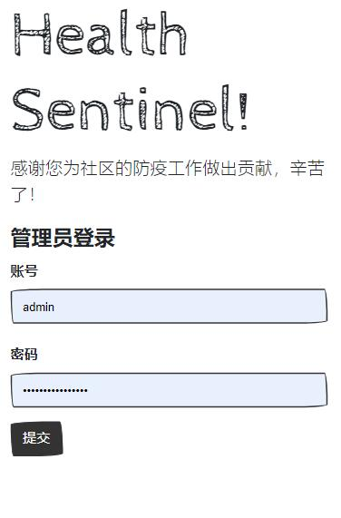
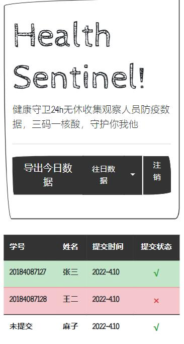

# 健康哨兵

(! 测试阶段 !)

> [English](./README.md) | 简体中文

# 什么是健康哨兵
健康哨兵是为了在当前中国疫情下方便班级收集健康码而设计的Web小程序，用于收集三码:

- 健康码
- 行程码
- 密接码

# 如何使用

## step1: 下载
`
    get github.com/ASWLaunchs/healthSentinel
`

## step2: 运行

`go run main.go`

## step3: 用户填表

中文链接: `localhost:22018?lang=zh`
英文链接: `lcoalhost:22018?lang=en`

## step4: 管理员后台

中文链接: `localhost:22018/login/?lang=zh`
英文链接: `localhost:22018/login/?lang=en`

# 运行截图

# 数据库依赖

