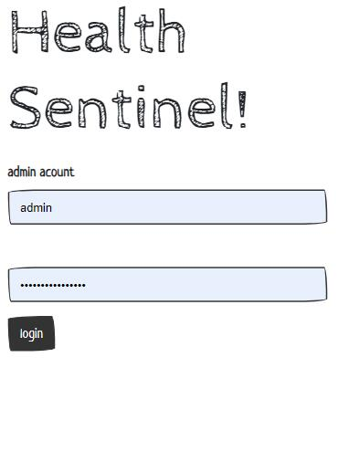
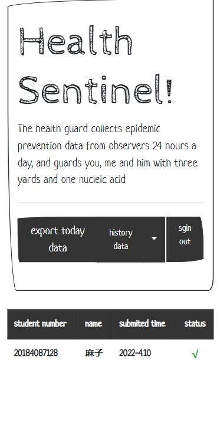
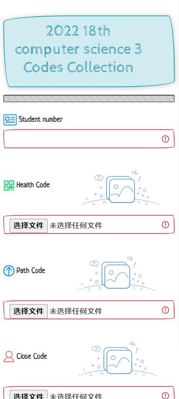

# HealthSentinel

(! Beta !)

> English |[简体中文](./README-CN.md)

# What is health Sentinel
Health Sentinel is a small Web program designed to collect health codes for classes in the current epidemic situation in China. It is used to collect three codes:

- health code
- path code
- close code

# How to use it

## step1: install
`
    get github.com/ASWLaunchs/healthSentinel
`

## step2: run

`go run main.go`

## step3: user view

Chinese link: `localhost:22018?lang=zh`
English link: `lcoalhost:22018?lang=en`

## step4: admin view

Chinese link: `localhost:22018/login/?lang=zh`
English link: `localhost:22018/login/?lang=en`

# configuration
All website configured in conf folders that `conf/conf.ini`.
i18n files in `data/i18n`.

# screenshot

---

# Database dependency

